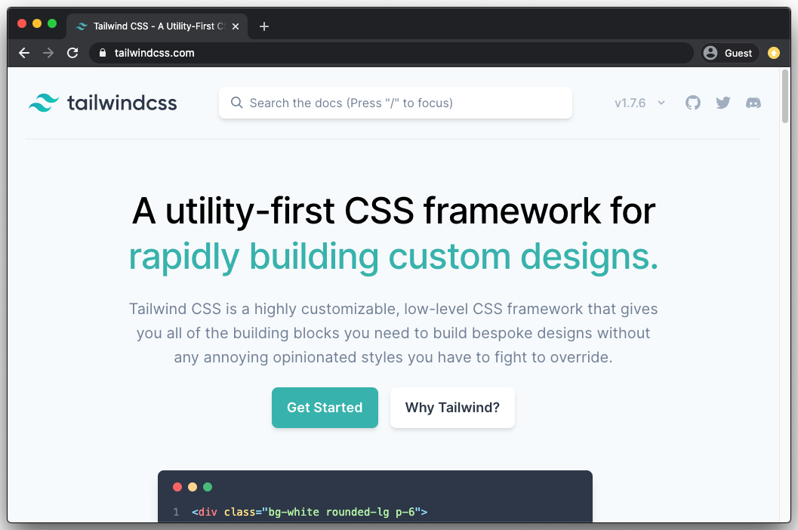
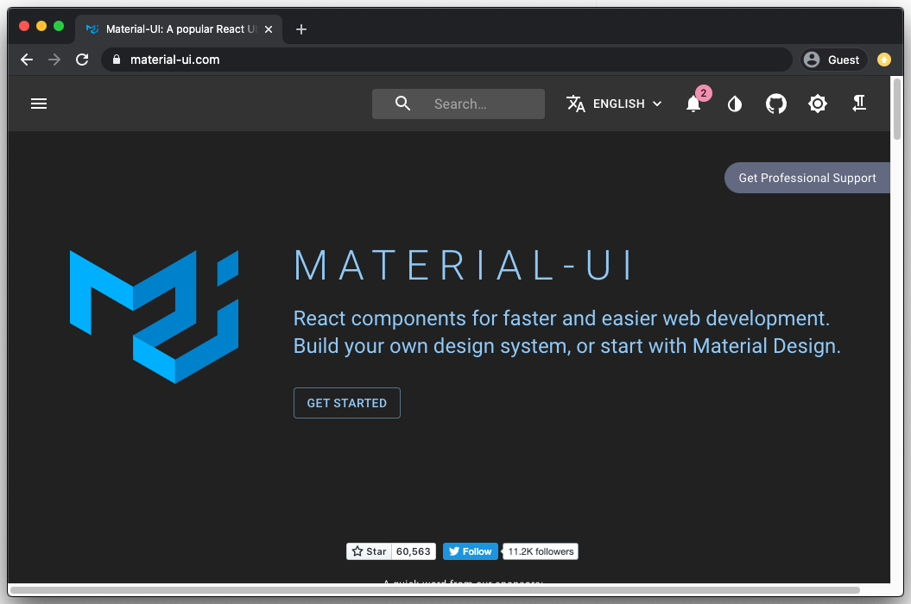
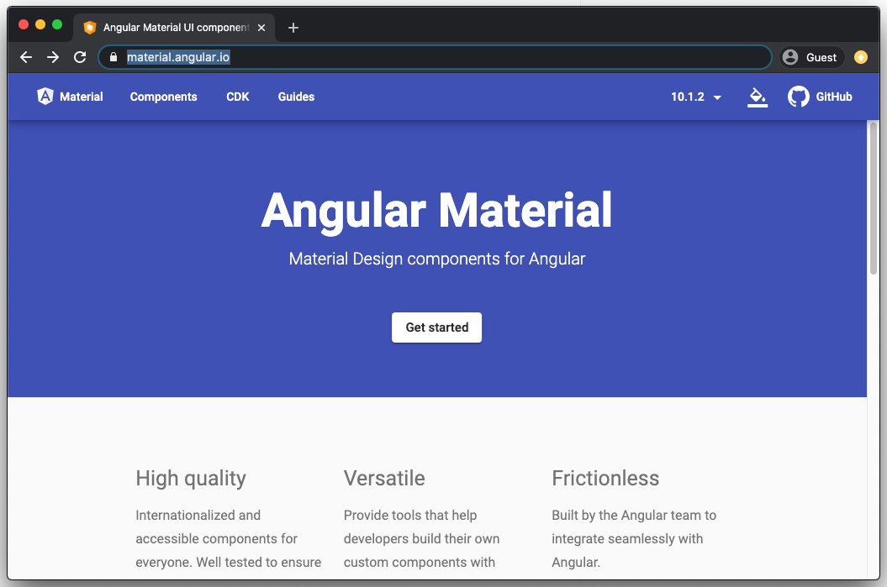

# Frontend-Frameworks

## Inhalt

* [Intro](#intro)
* [Vor- & Nachteile](#vor---nachteile)
* [Bekannte Frameworks](#bekannte-frameworks)
* [Angular & React spezifische Frameworks](#angular--react-spezifische-frameworks)
* [Wahl eines geeigneten Frontend-Frameworks](#wahl-eines-geeigneten-frontend-frameworks)

## Intro

Frontend-Frameworks sind **Werkzeugkasten** meist bestehend aus einer Ansammlung von Komponenten aus HTML-, CSS- und JS-Bausteinen.  

**Frontend-Framework ≠ JavaScript-Framework**

## Vor- & Nachteile

### Vorteile

* **Rapid Prototyping** &rightarrow; Viele Frameworks bieten fix fertige Komponenten an
* **Browser-Support** &rightarrow; Ist meistens sehr gut, da bereits jemand anderes an den Browsersupport gedacht hat
* **Community** &rightarrow; Viele der Framwroks haben eine eigene Community welche bei Problemen konsultiert werden kann

### Nachteile

* **Code Bloat** &rightarrow; Meist muss mehr Code importiert werden, als wirklich genutzt wird
* **Architecture** &rightarrow; Meistens sind CSS-Selektoren und z.B. JS-Libraries vorgegeben und **müssen** genutzt werden
* **Lernkurve** &rightarrow; Durch hohe Komplexität muss zum Teil viel Zeit investiert werden um das Framework zu "lernen"

## Bekannte Frameworks

### Bootstrap

Website: https://getbootstrap.com/

### Foundation

Website: https://get.foundation/

### Tailwind _(neuer)_

Website: https://tailwindcss.com/

**Weitere Frontend-Frameworks**

* [Material Design Lite](http://getmdl.io)
* [Pure.css](http://purecss.io)
* [Semantic UI](http://semantic-ui.com/)
* etc.

## Angular & React spezifische Frameworks

### Material UI for React

Website: https://material-ui.com/  
Getting Started: https://material-ui.com/getting-started/installation/

### Angular Material

Website: https://material.angular.io/  
Getting started: https://material.angular.io/guide/getting-started

**Weitere Frontend-Frameworks**

React
* [Material Kit](https://www.creative-tim.com/product/material-kit-react/)
* [React Bootstrap](https://react-bootstrap.github.io/)
* [Semantic UI](https://react.semantic-ui.com/)
* [React Toolbox](http://react-toolbox.io)
* [Onsen UI](https://onsen.io/react/)
* etc.

Angular
* [Prime NG](https://www.primefaces.org/primeng/#/)
* [NG Bootstrap](https://valor-software.com/ngx-bootstrap/#/)
* [Onsen UI](https://onsen.io/angular2/)
* etc.

## Wahl eines geeigneten Frontend-Frameworks

* **Architektur** &rightarrow; Passt das gewählt Framework zu eurem Projekt?
* **Funktionsumfang** &rightarrow; Habt ihr alles was ihr benötigt?
  * **Modularisierung** &rightarrow; Könnt ihr selektiv entscheiden, was in euer Projekt importiert wird?

> **Das Wichtigste in Kürze**
>  
> * Frontend-Frameworks sind dazu da, dem Developer das leben zu vereinfachen und einen gewissen kickstart zu geben für ein neues Projekt.
> * Sie bieten meinst verschiedenste Komponenten die man nutzen kann.
> * Meist ist das Einbinden eines Frontend-Frameworks eine grosse Entscheidung die auch mit negativem verbunden ist (z.B. festgelegte CSS Naming Convention).
> * JavaScript Libraries und Frameworks haben öfters ihre eigene spezifische Implementation eines Frontend-Frameworks

## Practice 🔥

Learning by doing

- [ ] Überlegt anhand der Kriterien, ob ihr ein Framework in eurem Projekt nutzen wollt
  - [ ] Falls ja, folgt dem Getting started guide um es in euer Projekt einzubinden

Zeit: ~ ♾️ min
